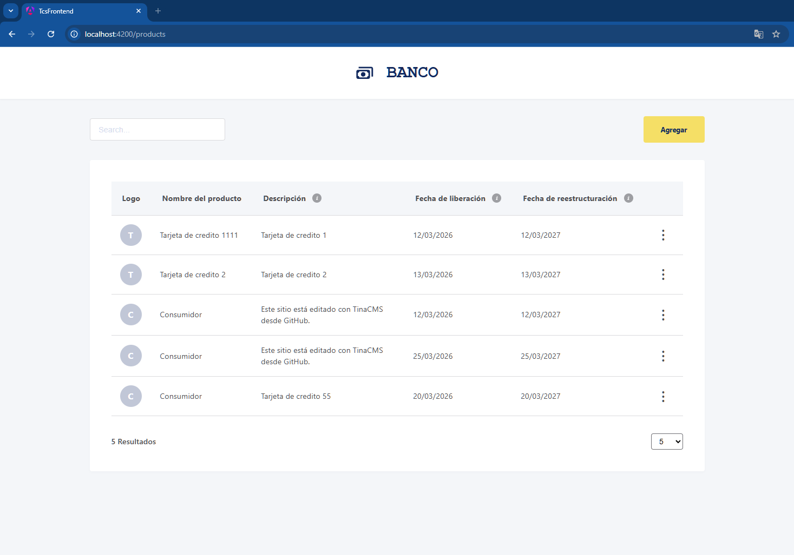
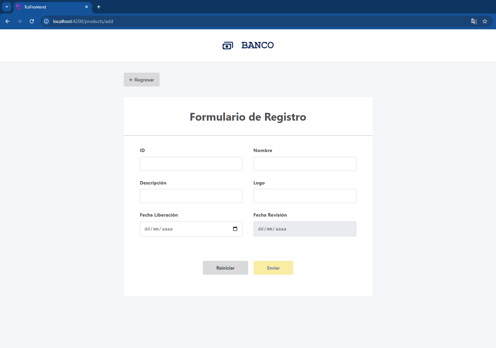
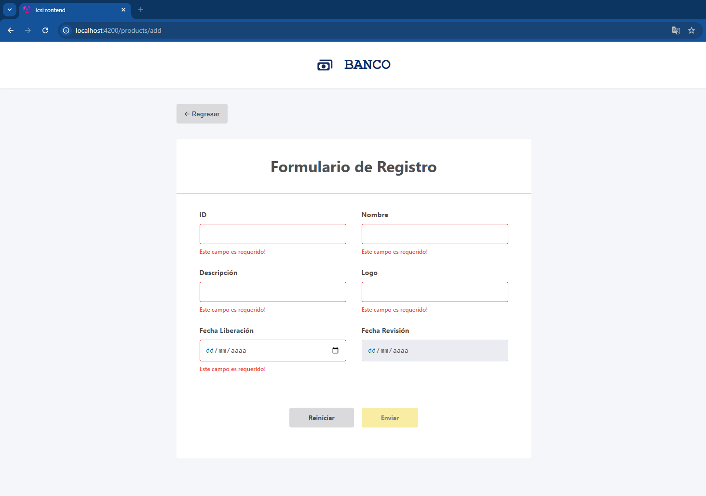
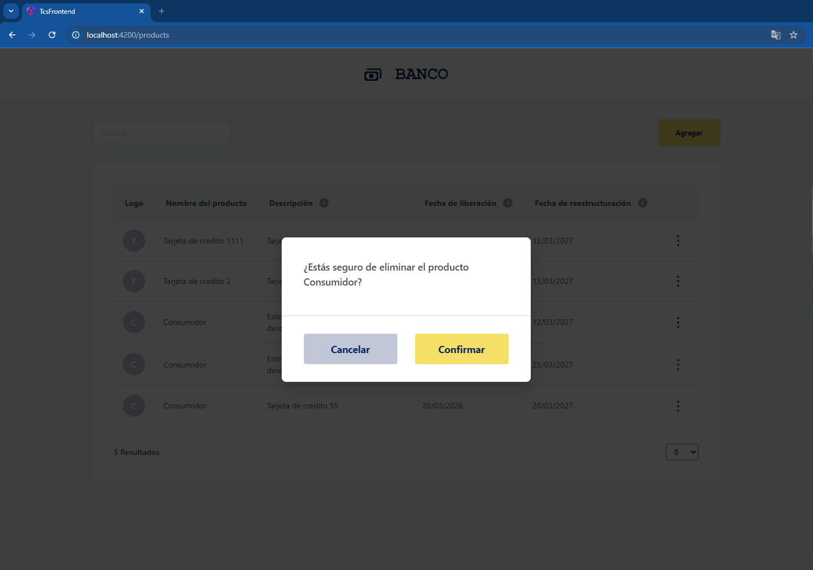
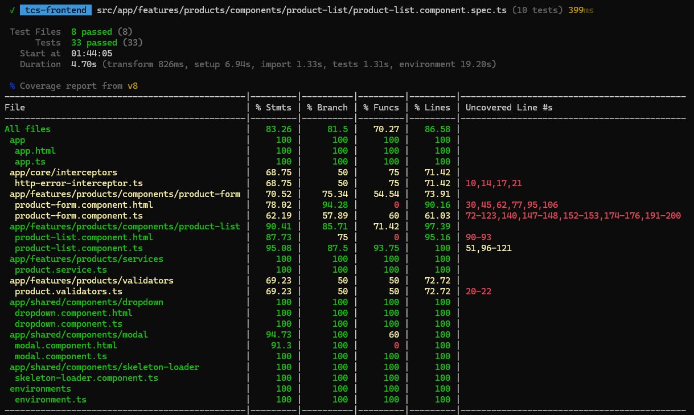

# Tata Consultancy Services (TCS) - Frontend Challenge
**Financial Product Management System**


This project represents a robust, scalable frontend solution for managing financial products, developed as a Senior-level technical assessment. It strictly adheres to **Clean Code**, **SOLID principles**, **Modular Architecture**, and **Reactive Programming** standards.

* **Dashboard overview displaying reactive filtering, dynamic pagination, and action menus.**
</img>

* **Product registration form**
</img>

* **Product registration form - error message validation**
</img>

* **Product deletion confirmation message**
</img>


## Implemented Features

The application fully implements all required functionalities specified in the business requirements:

* **F1. Product Listing:** Displays financial products fetched from the API with skeleton loaders for improved UX.
* **F2. Reactive Search:** Real-time product filtering by text input without mutating the original dataset.
* **F3. Dynamic Pagination:** Selectable results limit (5, 10, or 20 items) that strictly reflects the currently displayed dataset.
* **F4. Product Creation:** Full registration form with complex synchronous and asynchronous validations.
* **F5. Product Editing:** Contextual dropdown menus allowing users to update product details while keeping the ID locked.
* **F6. Deletion & Modal:** Secure deletion flow requiring user confirmation via a custom-built modal component.

## Business Rules & Strict Validations

The forms include comprehensive validation layers ensuring data integrity before any API interaction:

* **ID:** Required, 3-10 characters, **Async validation** (verifies non-existence via API).
* **Name:** Required, 5-100 characters.
* **Description:** Required, 10-200 characters.
* **Logo:** Required URL string.
* **Release Date:** Required, must be equal to or greater than the current date.
* **Revision Date:** Required, must be **exactly one year** after the Release Date.


## Edge Cases & Backend Discrepancies

During integration with the **TCS-provided Node.js backend**, a critical discrepancy was identified between the business requirements document and the actual backend implementation:

* **Name Length Conflict:** The PDF specification states that the `name` field requires a **minimum of 5 characters**. However, the provided backend endpoint (`POST /bp/products`) strictly enforces a `ProductDTO` with a **minimum of 6 characters**, throwing a `400 Bad Request` if 5 characters are sent.
* **The Resolution (Backend Contract Priority):** The frontend reactive form validation was intentionally adjusted to `minLength(6)` to match the backend's source of truth. This proactive decision prioritizes production stability and prevents guaranteed HTTP errors. A specific comment (`// NOTA PARA EL EVALUADOR...`) was strategically left in the component's source code to demonstrate awareness of the documentation discrepancy while justifying the engineering decision.


## API Integration

The frontend seamlessly communicates with the provided local Node.js backend, implementing an `HttpInterceptor` for global error handling. The following endpoints are actively consumed:

* `GET /bp/products` - Fetches the product list.
* `POST /bp/products` - Creates a new product.
* `PUT /bp/products/:id` - Updates an existing product.
* `DELETE /bp/products/:id` - Removes a product.
* `GET /bp/products/verification/:id` - Asynchronously verifies ID availability during form input.

## Architecture & Performance

* **Angular (Standalone Components):** Eradicated `NgModules` boilerplate for faster bootstrapping and a cleaner dependency tree.
* **RxJS Streams:** Implemented asynchronous data flows using `combineLatest` for search and pagination, avoiding manual state mutations.
* **UI Decoupling:** Modals, Dropdowns, and Skeletons are built from scratch without external UI libraries, proving deep CSS/DOM manipulation skills.

## Testing Strategy & Coverage

The project exceeds the minimum 70% coverage requirement, delivering a highly resilient testing suite using **Vitest**. 


* **Deterministic Mocks:** Unit tests are completely decoupled from the real backend. `ProductService` is fully mocked to guarantee CI/CD reliability.

* **RxJS Testing:** Handled complex `combineLatest` streams using `firstValueFrom` and `.pipe(skip())` to ensure assertions run on the correct data emissions.

* **Tests with Coverage above 70%.**
</img>


## 🛠️ Installation & Setup

### 1. TCS Backend Setup
You must run the provided Node.js backend (`repo-interview-main.zip`) for the application to function properly:

```bash
# 1. Unzip repo-interview-main.zip and navigate into the folder
cd repo-interview-main
# 2. Install dependencies
npm install
# 3. Start the local server
npm run start:dev
# The API will be available at http://localhost:3002
```

### 2. Frontend Application Setup
Clone the current repository `https://github.com/jpaul34/tcs-frontend` and a new terminal in this frontend repository run:

```bash
# 1. Install dependencies
npm install
# 2. Run the development server
npm start
# 3. Run the test suite with coverage report
npm run test -- --coverage
# 4. Build for production
npm run build
```


